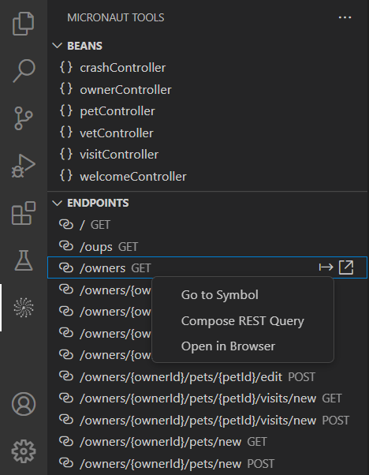
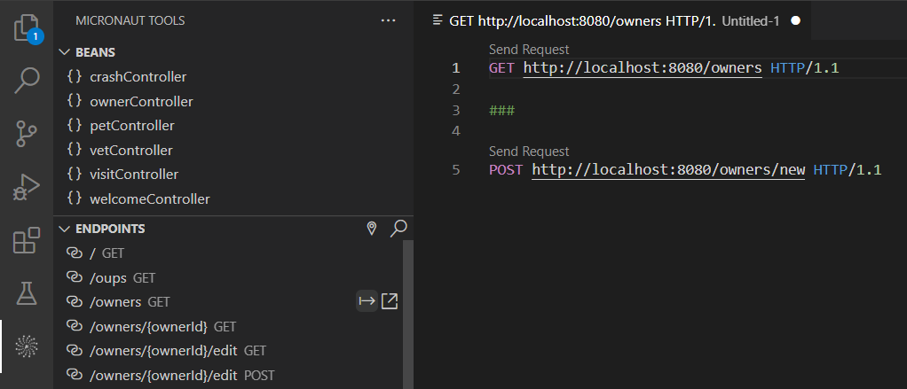
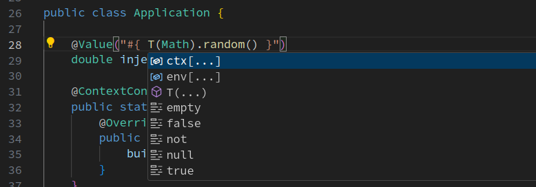
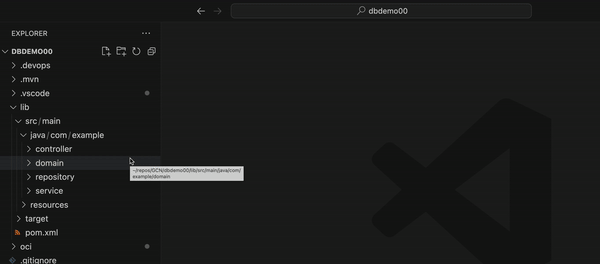
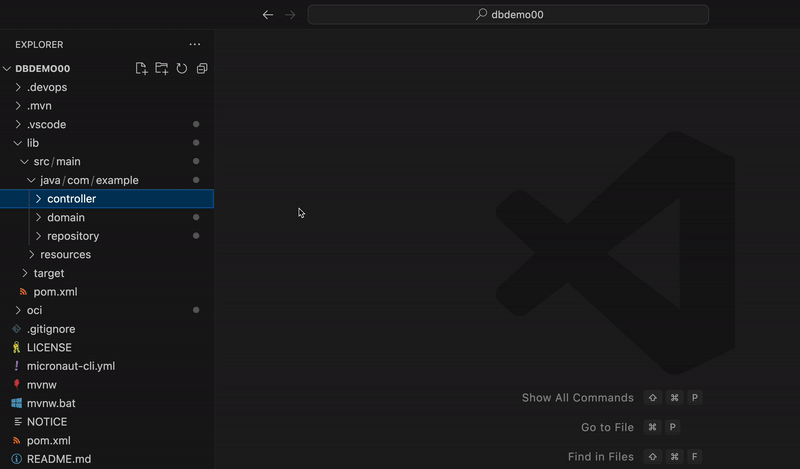

# Micronaut® Tools
*** Technology Preview ***

## Overview
Micronaut Tools is a powerful extension for using [GraalVM](https://www.oracle.com/java/graalvm/) to develop [Micronaut framework](https://micronaut.io/) and [Graal Cloud Native](https://graal.cloud/) applications within VS Code.

Install the [Graal Cloud Native Extension Pack](https://marketplace.visualstudio.com/items?itemName=oracle-labs-graalvm.graal-cloud-native-pack), which contains this extension and others.

## Features
* [View Suggested Code Completions](#view-suggested-code-completions)
* [Navigate Micronaut Source Code](#navigate-micronaut-source-code)
* [View Defined Beans and Endpoints](#view-defined-beans-and-endpoints)
* [Compose REST Queries](#compose-rest-queries)
* [Editor Support for Micronaut Expression Language](#editor-support-for-micronaut-expression-language)
* [Run Your Micronaut Application](#run-your-micronaut-application) 
* [Live Reloading of Applications](#live-reloading-of-applications)
* [Debug Your Micronaut Application](#debug-your-micronaut-application)
* [Package Your Micronaut Application](#package-your-micronaut-application)
* [Create a Native Executable from Your Micronaut Application](#create-a-native-executable-from-your-micronaut-application)
* [Build a Container Image and Deploy Your Micronaut Application to a Container Registry](#build-a-container-image-and-deploy-your-micronaut-application-to-a-container-registry)
* [Deploy Your Application to Oracle Cloud Infrastructure](#deploy-your-application-to-oracle-cloudinfrastructure)
* [Connect to an Oracle Autonomous Database](#connect-to-an-oracle-autonomous-database)
* [Create Entity and Repository Classes From an Existing Database Schema](#create-entity-and-repository-classes-from-an-existing-database-schema)
* [Create Micronaut Controller Classes from Micronaut Data Repositories](#create-micronaut-controller-classes-from-micronaut-data-repositories)

If you want to request a feature or find a bug, please [let us know](#feedback).

## Requirements
- VS Code (version 1.76.0 or later).
- The [Extension Pack for Java from Microsoft](https://marketplace.visualstudio.com/items?itemName=vscjava.vscode-java-pack).
VS Code will prompt you to install the extension when you open a Micronaut project (for more information, see [Java in VS Code](https://code.visualstudio.com/docs/languages/java)).
- (Optional.) A Java Development Kit (JDK) installation (JDK 17 or later).
[Oracle GraalVM](https://www.oracle.com/java/graalvm/) is a fast and efficient JDK from Oracle.

## Installing the Extension
Click **Install** on the banner above or from the Extensions sidebar in VS Code by searching for "Micronaut Tools".

You can also find the extension listed on the [VS Code Marketplace](https://marketplace.visualstudio.com/items?itemName=oracle-labs-graalvm.micronaut).

The Micronaut Tools page opens as soon as the extension is installed.
You can also open this page using the Command Palette command **Micronaut Tools: Show Micronaut Tools Page**.

> Note: This extension is part of the [Graal Cloud Native Extensions Pack](https://marketplace.visualstudio.com/items?itemName=oracle-labs-graalvm.graal-cloud-native-pack). We recommend you install the Graal Cloud Native Extensions Pack as it provides additional extensions for Micronaut development, including the [Micronaut Launch](https://marketplace.visualstudio.com/items?itemName=oracle-labs-graalvm.micronaut) extension.

## Usage

### View Suggested Code Completions

The extension suggests code completions for your YAML configuration files.
(The available configuration properties and their values are collected by scanning your source code and the Micronaut libraries.)

The extension also provides code completion for your Java source code via the [Extension Pack for Java from Microsoft](https://marketplace.visualstudio.com/items?itemName=vscjava.vscode-java-pack).
This gives you all the IDE features that you would expect from [IntelliSense](https://code.visualstudio.com/docs/editor/intellisense), as well as automatically highlighting errors as you type.

### Navigate Micronaut Source Code

You can easily navigate to Micronaut-specific elements of your source code via the **Go to Symbol in Workspace** command.

Run the **Go to Symbol in Workspace** command using Ctrl+T (Cmd+T on macOS) and enter the prefix:
* `@/` to show all defined request mappings
* `@+` to show all defined beans


### View Defined Beans and Endpoints
All beans and request mappings defined by a Micronaut or GCN application can be displayed in the Beans and Endpoints views of the Micronaut Tools activity.

The items of these views can be searched/filtered using a dedicated action available in the view captions or invoked using the Ctrl+F shortcut.

Clicking a node in one of these views navigates to the corresponding source code, similar to the Go to Symbol in Workspace command. This can also be invoked using a dedicated context menu action:
* **Go to Symbol** to open the bean or request mapping source code

The request mapping nodes in the Endpoints view also provide two additional actions:
* **Open in Browser** to open the GET endpoint in a web browser
* **Compose REST Query** to insert the corresponding query into a dedicated text document. See the following section Compose REST Queries for details.

Similar actions are also available in the code editor as Code Lens actions.

For endpoints containing parameters, a dialogue is opened to provide concrete values before opening in a browser or generating a REST query. Tip: Type a parameter value and submit by Enter to move to another parameter.

The base address of the running Micronaut or GCN application is by default configured to `http://localhost:8080` and can be customized using the Edit Target Application Address action in the Endpoints view caption or next to a folder node in case multiple folders are opened in the workspace.




### Compose REST Queries
To easily debug and test the application REST API, the Endpoints view provides a smooth integration with a third-party extension [REST Client](https://marketplace.visualstudio.com/items?itemName=humao.rest-client).

To compose a REST query, invoke the Compose REST Query action for an endpoint either from the Endpoints view or using the corresponding Code Lens action in the code editor. A dedicated text document is opened, and the corresponding query is inserted. Use the REST Client features to invoke and process the query.

> **Note**: If the REST Client extension is not installed when invoking the Compose REST Query action, a notification is displayed offering to quick install it.



### Editor Support for Micronaut Expression Language
Since 4.0, Micronaut framework supports embedding evaluated expressions in annotation values using the `#{…​}` syntax. 
The extension provides a full editor support for the [Micronaut Expression Language](https://docs.micronaut.io/latest/guide/#evaluatedExpressions) including:
* Code completion
* Documentation hovers for used Java elements and Micronaut configuration properties
* Code navigation to used Java elements and Micronaut configuration properties
* Syntax coloring



### Run Your Micronaut Application

The easiest way to run your Micronaut application is to view the `Application` class in the editor and click **Run** above the `main()` method, as shown here.


> **Note**: If you have defined a database connection, see [Connect to an Oracle Autonomous Database](#connect-to-an-oracle-autonomous-database), then the database connection details will be passed to your running application through an argument file when running the application in this way.

Alternatively, select **Run Without Debugging** from the **Run** menu.

### Live Reloading of Applications

Micronaut can automatically recompile and restart your application (or its parts) when it detects changes to your source code.
(This is called "Continuous Mode".)
To run your Micronaut application in this mode, view the `Application` class in the editor and click **Run with Micronaut Continuous Mode** above the `main()` method, as shown here.


Alternatively, select **Run and Debug** in the activity bar and click **Create a launch.json file**.
When prompted, select **Java** as the debugger.
A configuration that will be labelled with "Continuous" will be created for your Micronaut application main class(es), similar to this example:


Select the newly added configuration in the **Run and Debug** view, then click **Run**.

### Debug Your Micronaut Application

The easiest way to run your Micronaut application is to view the `Application` class in the editor and click **Debug** above the `main()` method, as shown here.


Alternatively, select **Start Debugging** from the **Run** menu.

### Package Your Micronaut Application

To package your application as a runnable JAR file, follow these steps:

1. Select **Command Palette** from the **View** menu.
Enter "Micronaut Tools" and invoke the **Micronaut Tools: Build...** command.

2. Select the **compile** build goal from a list of available goals.

    

3. When the compilation is complete, invoke the **Micronaut Tools: Build...** command again.
This time, select the **package** goal, which will package your application into a JAR file.

### Create a Native Executable from Your Micronaut Application

If you have installed Oracle GraalVM, you can use GraalVM Native Image to create a native executable from your application.
GraalVM Native Image creates an executable file with all the application classes, dependent library classes, dependent JDK classes, and a snapshot of the application heap. 
Whilst building a native executable can take some time, the benefits include a dramatic reduction in startup time and reduced overall memory consumption.

> **Note**: The time to build an executable depends on application size and complexity.

To create a native executable, follow these steps:

1. Select **Command Palette** from the **View** menu.
Enter "Micronaut Tools" and invoke the **Micronaut Tools: Build...** command.

2. Select the **compile** build goal from a list of available goals.

    

3. When the compilation is complete, invoke the **Micronaut Tools: Build...** command again.
This time, select the **nativeImage** goal, which creates a native executable from your application.

    * If your application is built with Maven, the goal runs the command `mvnw package -Dpackaging=native-image`.
    The resulting native executable will be in the _target/native-image/_ directory.

    * If your application is built with Gradle, the goal runs the command `gradlew nativeCompile`.
    The resulting native executable will be in the _build/native/nativeCompile/_ directory.

To run your Micronaut application as a native executable, open a terminal by selecting **New Terminal** from the **Terminal** menu, then run the following command: 

* If you used Maven: `./target/<executable-name>`
* If you used Gradle: `./build/native/nativeCompile/<executable-name>`

For more information, see the [Micronaut documentation](https://guides.micronaut.io/latest/micronaut-creating-first-graal-app.html).

> **Note**: If you are using VS Code on the Windows platform, invoke the **Micronaut Tools: Build Native Image** command from the Command Palette. 

### Build a Container Image and Deploy Your Micronaut Application to a Container Registry

You can build a container image of your Micronaut application, or create a container image of an executable created by GraalVM Native Image.
You can then deploy the container image.

To build and deploy a container image of your application, follow these steps:

1. Select **Command Palette** from the **View** menu.
Enter "Micronaut Tools" and invoke the **Micronaut Tools: Deploy...** command.

2. Select select one of the goals from the list:
    - To deploy a containerized Micronaut application, select the **dockerPush** goal.
    - To deploy a containerized native executable, select the **dockerPushNative** goal.

To configure your application's container registry, see the documentation for [Micronaut Maven Plugin](https://micronaut-projects.github.io/micronaut-maven-plugin/latest/)/[Micronaut Gradle Plugin](https://micronaut-projects.github.io/micronaut-gradle-plugin/latest/). 

### Deploy Your Application to Oracle Cloud Infrastructure

**Prerequisites:**
* An Oracle Cloud Infrastructure (OCI) account.
* The [OCI DevOps Tools extension](https://marketplace.visualstudio.com/items?itemName=oracle-labs-graalvm.oci-devops) (part of the [Graal Cloud Native Extension Pack](https://marketplace.visualstudio.com/items?itemName=oracle-labs-graalvm.graal-cloud-native-pack)).

The OCI DevOps Tools extension provisions build and deployment pipelines for:
* An OCI native executable container: a containerized native executable
* An OCI Java container: a containerized Micronaut application

It can also provision a cluster to run your container on Oracle's [Container Engine for Kubernetes](https://docs.oracle.com/iaas/Content/ContEng/Concepts/contengoverview.htm).
For more information about using the OCI DevOps Tools Extension, see [Using OCI DevOps Tools Extensions in VS Code](https://www.graal.cloud/gcn/get-started/using-gcn-vscode-tools/).

### Connect to an Oracle Autonomous Database

By connecting to an Oracle Autonomous Database in VS Code, you can browse the schemas of any existing databases you may have and then quickly create a REST API that exposes them.

**Prerequisites:**
* An Oracle Cloud Infrastructure (OCI) account.

To connect to an Oracle Autonomous Database:

1. Expand the **DATABASES** view in the Explorer panel and click **Add Oracle Autonomous DB**.
If existing databases are in the view, you can skip to step **6**.
2. Select the compartment containing your database From the list of compartments.
3. From the list of databases, select your database.
4. Enter the username for the database.
5. Enter the password for the database.
The database will be added to the **DATABASES** view in the Explorer panel.
6. Select the database in the view, then right-click. 
Select **Connect to Database** from the menu.

To change the properties of a database connection, select the database in the **DATABASES** view, right-click and then select **Properties** from the menu.
> **Note**: Disconnect from the database before attempting to change its properties. You cannot change the properties of a _connected_ database. 

To select a database as the _Default Connection_, select the database in the **DATABASES** view, right-click and then select **Set as Default Connection** from the menu.

> **Note**: The database password is stored in an OS-specific secure storage mechanism. This will be one of the following: macOS keychain; KDE Wallet; GNOME/Keyring; Windows Data Protection API;
When running or debugging a micronaut application from within the editor, a temporary argument file will be created that contains any properties required by the running application. This may include the database username and password. This file passes the application configuration to the application when it is started. Please note that this temporary file is only readable by the user running VSCode and is deleted as soon as the run/debug session finishes.

### Using the OCI Vault to Store Database Connection Properties
The Micronuat Tools VS Code extension now supports storing an application's database configuration within an [OCI Vault](https://docs.oracle.com/en-us/iaas/Content/KeyManagement/Concepts/keyoverview.htm_). The vault is a secure service within OCI for managing application secrets.

To make use of this new feature, you are required first to create an [OCI Vault](https://docs.oracle.com/iaas/Content/KeyManagement/Tasks/managingvaults_topic-To_create_a_new_vault.htm) and [Master Encryption Key](https://docs.oracle.com/iaas/Content/KeyManagement/Tasks/managingkeys_topic-To_create_a_new_key.htm) using the Oracle Cloud Console. Please consult the OCI documentation, previously linked, on how to do this.

>If your project is already using the [OCI DevOps service](https://www.oracle.com/devops/devops-service/), then make sure the [OKE Deployments Pipelines are created](https://graal.cloud/gcn/vscode-tools/oci-devops-tools/#build-and-deploy-project-artifacts) before you proceed.

To store your application database connection details in the vault and for these to be made available to your application when you deploy to OKE using the OCI DevOps service, you must:

1. Connect to an Oracle Autonomous Database as described above in the *Connect to an Oracle Autonomous Database* section.
2. Ensure your Micronaut project configuration file contains the _micronaut-oraclecloud-vault_ dependency.
   * _pom.xml_
   ```
    <dependency>
     <groupId>io.micronaut.oraclecloud</groupId>
     <artifactId>micronaut-oraclecloud-vault</artifactId>
    </dependency>
    ```
   * _build.gradle_
   ```
     implementation("io.micronaut.oraclecloud:micronaut-oraclecloud-vault")
   ```
3. Right-click the database name in the Databases panel and choose **Add to OCI Vault**

   

4. From the list of Compartments, select the compartment with an existing Vault. (If there is more than one vault, select the one to store your database properties.)
5. From the list of keys, select the key to encrypt your database properties. If there is only one key, this step is skipped and the default encryption key is used.
6. Provide a custom **Datasource Name**.
7. Click **Enter**. The database properties are stored in your OCI Vault. A notification is shown at the bottom of the VS Code window.
8. If the project is stored in OCI DevOps, then running the deployment pipelines from within the OCI DevOps panel will use the Database properties stored in OCI Vault in the previous steps.

> Note: If OKE Deployment Pipelines were modified as described above, the OKE ConfigMap named <_project_name_>__oke_configmap_ would be used. The deployment then uses the database properties stored in your OCI Vault to run a Micronaut application in OKE securely and seamlessly. Learn more about this in the [OCI DevOps Tools](https://marketplace.visualstudio.com/items?itemName=oracle-labs-graalvm.oci-devops) extension documentation.

### Create Entity and Repository Classes From an Existing Database Schema

With a connection to an Oracle Autonomous Database created, see the previous section, you can quickly create [Micronaut Data](https://micronaut-projects.github.io/micronaut-data/latest/guide/) entity classes for the tables within the database.

**Prerequisites:**
* You have created a connection to a database with an existing schema. 
(See above.)
* You have selected the database as the _Default Connection_.
(See above.)

To create Micronaut Data entity classes:
1. Create a new Micronaut project in VS Code (or open an existing one).
2. Create a new Java package in your project, for example, `com.example.micronaut.entities`.
3. Right-click the package name and select **New From Template...** from the menu.
4. When prompted, select **Micronaut**, then **Micronaut Data Entity Classes from Database**.
5. From the list of tables, select the tables for which you want to create corresponding entities. 
6. Click **Enter**.



In a similar way, we can also create Micronaut Data repository classes - note this requires that you have already created entity classes (see above):
1. Create a new Micronaut project in VS Code (or open an existing one).
2. Create a new Java package in your project, for example, `com.example.micronaut.repositories`.
3. Right-click the package name and select **New From Template...** from the menu.
4. When prompted, select **Micronaut**, then **Micronaut Data Repository Interfaces from Entity**.
5. Choose if **Repository Interfaces** should to be based on **CRUD**, or **Pageable**. The default is **CRUD**.
6. From the list of entities, select the entities for which you want to create corresponding repositories.
7. Click **Enter**.


### Create Micronaut Controller Classes from Micronaut Data Repositories

By creating Controllers that expose your Micronaut Data repository classes, you can quickly turn them into a REST API. Create your Micronaut Data entity and repository classes first and then:

1. Right-click the package name and select **New From Template...** from the menu.
2. When prompted, select **Micronaut**, then **Micronaut Controller Classes (from Data Repositories)**.
3. From the list of repositories, select one or more items.
4. Click **Enter**

A controller that has access to the data repository is generated. By default, it contains a REST endpoint to access the repository's `findAll()` method in its `list()` method.

Other REST Endpoints accessing Repository members can be added to the controller. This can be done either through **code completion** (select the desired method from the list) or directly from the editor:  **Source Action... | Generata Data Endpoint...**.

Currently, `delete()` and `get()` methods are provided; both are annotated with the Data Entity `@id` parameter. 



## Extension Settings

The extension contributes the following settings:

* __micronaut-tools.showWelcomePage__ - when set to `true` (default), show the Micronaut Tools page on extension activation.
* __micronaut-tools.jdt.buildsystemExecution__ - if set to `true` (default), enables enhanced Run support for Micronaut applications.
* __micronaut-tools.targetApplicationAddress__ - default Micronaut or Graal Cloud Native application address, by default configured to `http://localhost:8080` (to be customized in `settings.json` in project folder).

## Micronaut Commands

Invoke the Micronaut commands from the Command Palette, then search for "Micronaut Tools".
To open the Command Palette, select **Command Palette** from the **View** menu.

The following commands are available for Micronaut project development:

* **Micronaut Tools: Show Micronaut Tools Page**: show the Micronaut Tools page with basic information describing this extension
* **Micronaut Tools: Build Native Executable**: build a native executable of your application using GraalVM native image
* **Micronaut Tools: Build...**: offers several the most important build tasks/targets wrapped as predefined commands for your Micronaut project
* **Micronaut Tools: Deploy...**: deploys a JVM container or native executable container into a container registry.
The container registry **MUST** be configured in the docker toolchain on the machine from which deployment is initiated.
See your docker tools documentation.
* **Micronaut Tools: Create Kubernetes Deployment Resource**: create a Kubernetes deployment resource for your application
* **Micronaut Tools: Create Kubernetes Service Resource**: create a Kubernetes service resource for your application
* **Micronaut Tools: Deploy to Kubernetes**: deploy to running Kubernetes services. The service must be configured in the Kubernetes tools (kubectl) on the machine from which deployment is initiated.
See your Kubernetes tools documentation.
* **Micronaut Tools: Run in Kubernetes**:  run already deployed application in Kubernetes service.
This command performs port forwarding at the end, and the running application can be accessed from the browser on your machine.
* **Micronaut Tools: Edit Target Application Address**: Customization of the base address of the running Micronaut or GCN application; the default is `http://localhost:8080`
* **Micronaut Tools: Search/Filter Beans**: Search or filter the items of the Beans view
* **Micronaut Tools: Search/Filter Endpoints**:  Search or filter the items of the Endpoints view

## Troubleshooting
This extension modifies Run for **Java** environment so that the application is launched using the build system (Gradle, Maven). These are so-called *Code lenses* shown above `main()` method `Run | Debug | Run with Micronaut Continuous Mode`. In some scenarios, the support may not support all customizations necessary for the user project and has to be turned off.

To enable or disable the enhanced Run feature, navigate to `File - Preferences - Settings`, locate `Micronaut Tools` extension section and turn on/off the `Use build system to run or debug applications`. The relevant setting (in JSON format) is `micronaut-tools.buildsystemExecution`

In some configurations of VSCode extensions Enhanced Run feature - code lenses for Micronaut and GCN applications `Run | Debug | Run with Micronaut Continuous Mode` are not displayed for **Gradle** projects when **Gradle for Java extension** is enabled. In such a case, it is necessary to disable Gradle for Java extension, reload VSCode and then enable Gradle for Java again. After this action, the Enhanced Run feature starts working, and code lenses `Run | Debug | Run with Micronaut Continuous Mode` appear.

Apache NetBeans Language Server for Java does not work on Linux and macOS when VSCode extensions directory contains space in the path, e.g. `/User/great code/.vscode/extensions`. This extension depends on Apache NetBeans Lang Server. Extensions directory is where all VSCode extensions are installed. The default location is:
* Windows `%USERPROFILE%\.vscode\extensions`
* macOS `~/.vscode/extensions`
* Linux `~/.vscode/extensions`

This location can be changed to the path without space:
* Permanently by setting environment variable `VSCODE_EXTENSIONS` for OS shell (bash, zsh, sh,...) modifying corresponding profile file (`.bash_profile`, `.zshrc`,...). Or
* Temporarily by launching VSCode from the command line with switch `--extensions-dir`, e.g. `$ code --extensions-dir "/User/code_user/extensions_dir"`
* It cannot be changed in VSCode Settings.

## Feedback

We would love to hear from you if you have suggestions for new features or if you have found a bug or issue. Use the links below:

* [Request a feature](https://github.com/oracle/gcn-vscode-extensions/issues/new?labels=enhancement)
* [File a bug](https://github.com/oracle/gcn-vscode-extensions/issues/new?labels=bug)

## Contributing

To submit pull requests to vscode-extensions, sign the [Oracle Contributor Agreement](http://www.oracle.com/technetwork/community/oca-486395.html).

Project members with write access to the repository will identify and assign an appropriate [Assignee](https://help.github.com/articles/assigning-issues-and-pull-requests-to-other-github-users/) for the pull request.
The assignee will work with the pull request owner to address any issues and then merge the pull request.

## Release Notes

Refer to [CHANGELOG](CHANGELOG.md).

